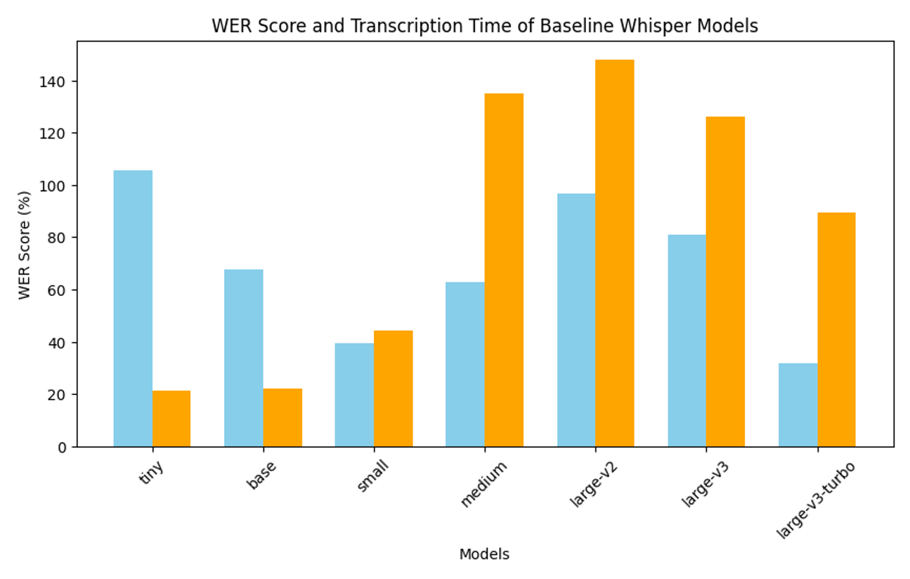

<b>Speech to Text Using Whisper  
A study of the automatic speech recognition model on Danish radio broadcasts  
</b>
 
<b> Astrid Hansen  
Ec Utbildning  
Kunskapskontroll 2 - Data Science Project 
24.10 
</b>
 
 
The main content of the repository is the data science report that describes the conducted study and the data science notebook that are a collection of the code that was used in the study. 
Besides these main files the repository contains the texts that were used as reference as well as the transcriptions that the models predicted, and the created dataset used for fine tuning. 
 
 
<b> CONTENTS in the NOTEBOOK</b>
* Audio EDA
* Audio Classification
* Text Preprocessing
* Creating a Dataset
* Test of Baseline Whisper Models
* Transcription with the Openai implementation of Whisper and Segment Analysis
* Transcription with Whisper-Large-v3-turbo Hugging Face Implementation
* Fine-tuning of the large-v3-turbo model
* Transcribing with the Fine-Tuned Large-v3-turbo model
* Transcribing with a Pretrained Whisper Medium Model trained on Commonvoice 11 dataset
* Evaluation of the Models
 

<b> ABSTRACT</b>  
The report focuses on the Whisper ASR model, which has shown promising results compared to other ASR models. The study aims to experiment with Whisper models to gain knowledge that can enhance the model's transcription performance on Danish radio broadcasts. Among the seven baseline models tested, the small and the large-v3 models yielded the best results in terms of word error rate (wer) and transcription time on a small data sample. 

The large-v3 model was fine-tuned on a small dataset created from another radio broadcast to test the fine-tuning process and its effect. The fine-tuned large-v3 model was then evaluated on a 2-hour audio file against the OpenAI implementation, the Hugging Face implementation of the large-v3 model, and a pretrained small model obtained from the Hugging Face hub. The Hugging Face implementation of the turbo model gave the best results in terms of a normalized wer-score on 20% when transcribing a long audio file. The fine-tuned model gave a norm. wer-score on 40% which indicates that further experiments of fine tuning the model are needed.  

<b> STRUCTURE</b> 
The first part of the study provides an overview of the theory needed to answer the questions posed above. To work with audio data requires an understanding of what digitalized sound is and how audio can be fed into ML models. The first section describes the characteristics of audio data, while the second part of the theory section focuses on the Whisper model, its architecture, implementations and characteristics.  

The next section revolves around the methodology of the study, detailing what and how the research questions will be answered. There will be an exploratory data analysis of the audio files with visualizations as well as an audio classification. A small section with processing of the manual transcription will also be conducted to be able to use these as reference text when evaluating the models' performances.    

Following this comes a section with examination of the baseline Whisper models performance on a small audio sample. The winning model will afterwards be investigated further by transcribing a longer audio file done with the openai as well as with the Hugging Face implementation. Afterwards the winning model will be trained on a small dataset created for the occasion. Another fine-tuned model from Hugging Face, that is trained on the common voice dataset, will as well be tested and the models’ performance will be evaluated.  

<b>RESULTS</b> 
The Whisper small and large-v3 models showed the best performance compared to the other baseline models. The small model transcribed faster, but the large-v3 model gave the best Word Error Rate (WER) score. The large-v3 model achieved a confidence level of 76% when inspecting the segment analysis. Further analysis of the segments per timestamp is needed if hyperparameters are to be adjusted for a given task.   

Out of the four models tested on a large audio file then the large-v3 model with the Hugging Face implementation gave the best results in terms of WER score. The fine-tuned model that was trained on similar radio broadcast did not yield better results than the baseline model. The lack of improvement in the WER score could be due to the training dataset being both small and lacking diversity, or that it simply was not a good representative sample for the audio files to be transcribed. The two audio files differ by 15 years and were broadcasted on two different channels targeting different segments of the population. It did perform better than the small pretrained model from the Hugging Face Hub, indicating that it may not be the size of the data set used for training that was the cause of the decrease in the WER score.  

Bar plot over the performance of the baseline models

 
Table with results of the training process of the large-v3-turbo model

| Epoch | Training Loss | Validation Loss | Wer        |
| ----- | ------------- | --------------- | ---------- |
| 1     | 1.478.400     | 1.563.958       | 37.234.043 |
| 2     | 0.529500      | 1.110.326       | 34.042.553 |
| 3     | 0.155100      | 1.099.420       | 42.553.191 |
| 4     | 0.078200      | 1.116.672       | 32.978.723 |
| 5     | 0.009800      | 1.110.293       | 40.425.532 |

 
Table with metrics of the performance of the four models that were tested on the 2-hour audio file

| model                     | wer      | wer_norm | substitutions | deletions | insertions |
| ------------------------- | -------- | -------- | ------------- | --------- | ---------- |
| openai-large-v3-turbo     | 0.456281 | 0.432879 | 1981          | 765       | 505        |
| hf-large-v3-turbo         | 0.226488 | 0.200717 | 635           | 834       | 224        |
| fine-tuned-large-v3-turbo | 0.427976 | 0.403128 | 859           | 2993      | 257        |
| WasuratS_whisper_small_da | 0.851353 | 0.813139 | 3772          | 4365      | 769        |

